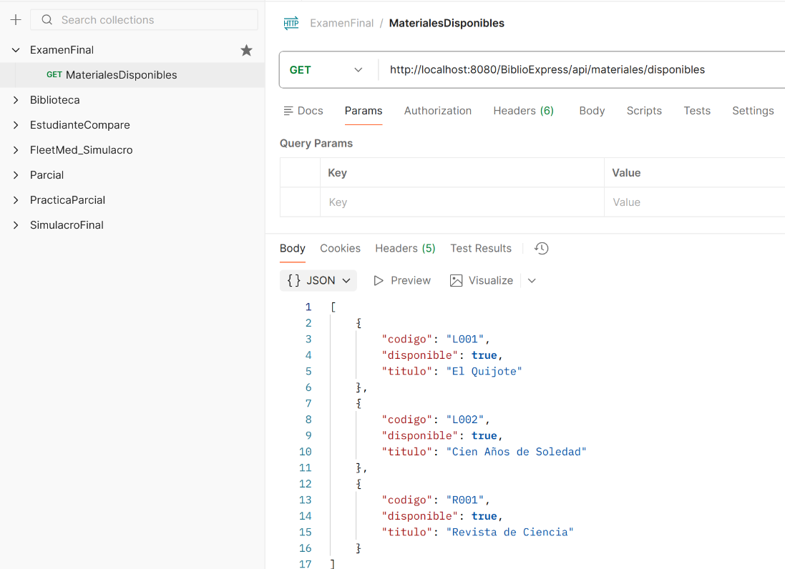
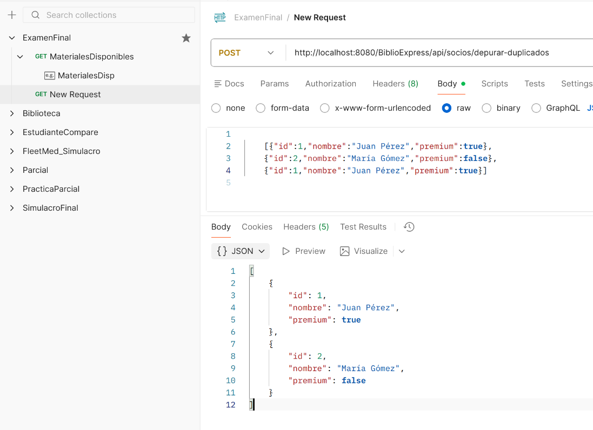
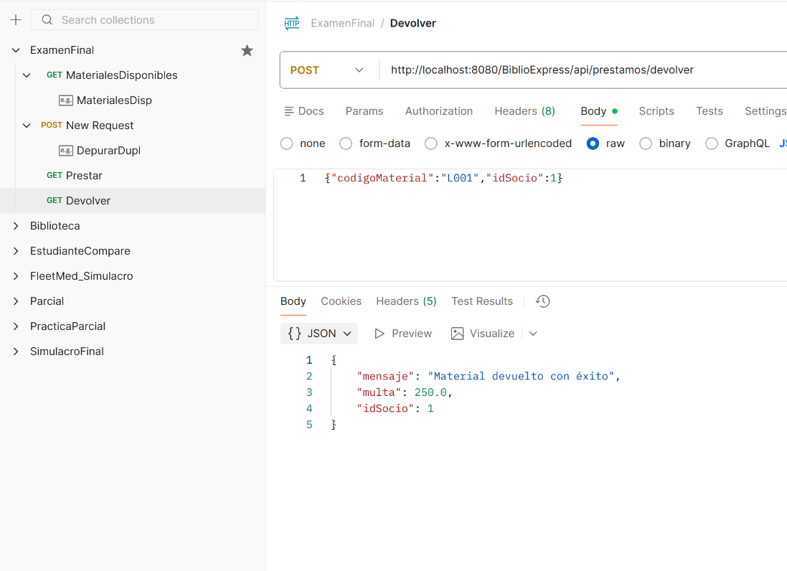
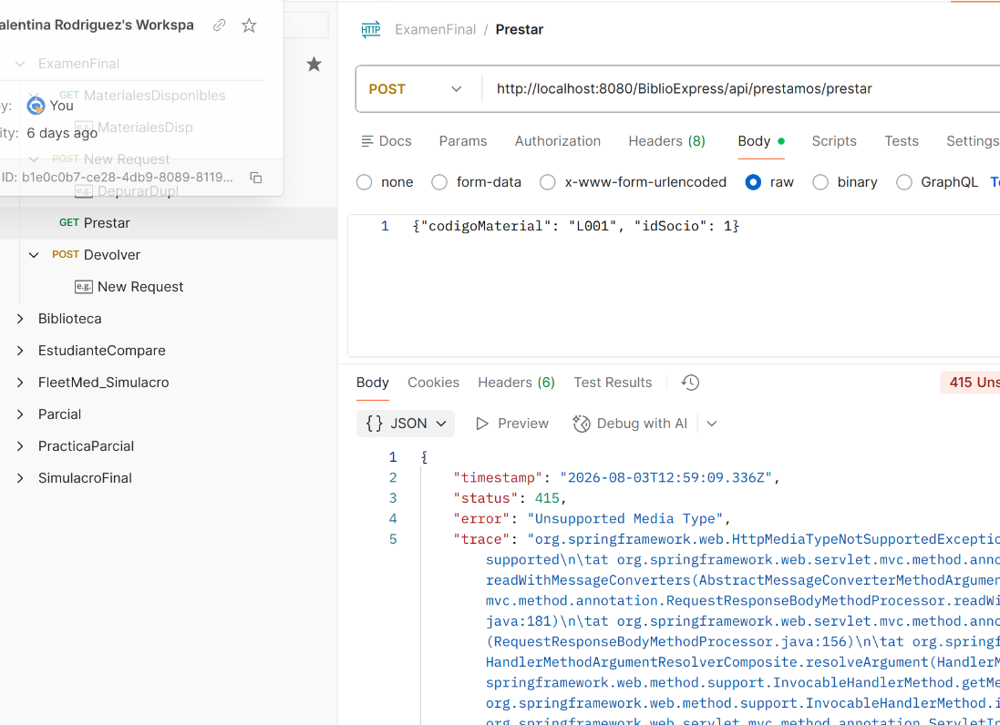

 Endpoint mostrar materiales disponibles

 Endpoint depurar duplicados

 Endpoint para devolver el material(con una entrada de ejemplo)

 Endpoint de solicitar el material

 Este endpoint de solicitar el material no funciona
